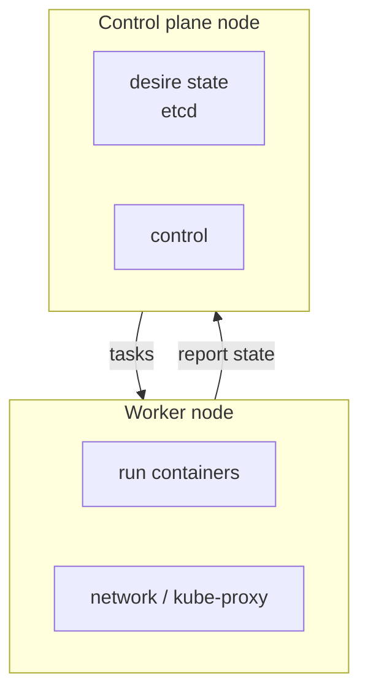

```mermaid
graph TD
    subgraph WorkerNode [Worker node]
        Run[run containers]
        Net[network / kube-proxy]
    end

    subgraph ControlPlaneNode [Control plane node]
        Desired["desire state
        etcd"]
        Control[control]
    end

    WorkerNode -->|report state| ControlPlaneNode
    ControlPlaneNode -->|tasks| WorkerNode

```
