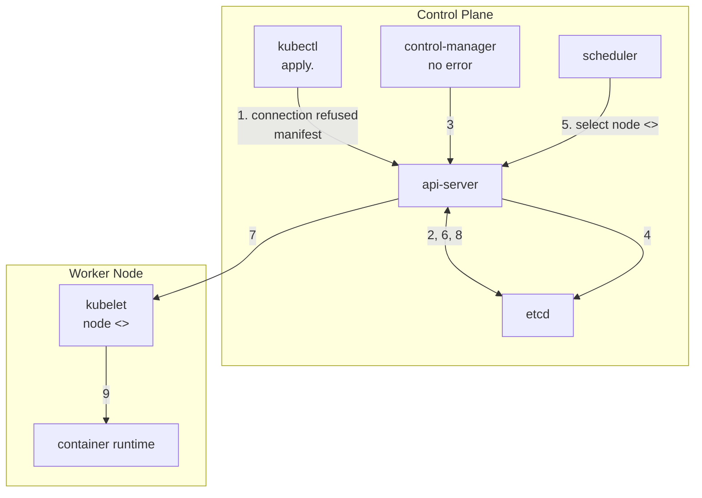

```mermaid
graph TD
    subgraph CP [Control Plane]
        Kubectl["kubectl
        apply."] -->|1. connection refused
        manifest| APIServer[api-server]

        APIServer <-->|2, 6, 8| Etcd[etcd]

        ControlManager["control-manager
        no error"] -->|3| APIServer

        Scheduler["scheduler"] -->|5. select node <<X>>| APIServer

        APIServer -->|4| Etcd
    end

    subgraph WN [Worker Node]
        APIServer -->|7| Kubelet["kubelet
        node <<X>>"]

        Kubelet -->|9| CR["container runtime"]
    end

```
