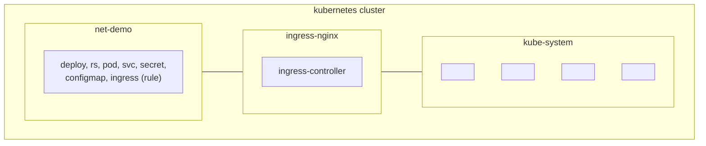

```mermaid
graph TD
    subgraph Cluster ["kubernetes cluster"]
        subgraph NS1 ["net-demo"]
            Resources["deploy, rs, pod, svc, secret,
            configmap, ingress (rule)"]
        end

        subgraph NS2 ["ingress-nginx"]
            Controller["ingress-controller"]
        end

        subgraph NS3 ["kube-system"]
            Sys1[ ]
            Sys2[ ]
            Sys3[ ]
            Sys4[ ]
        end
    end

    NS1 --- NS2
    NS2 --- NS3

```
