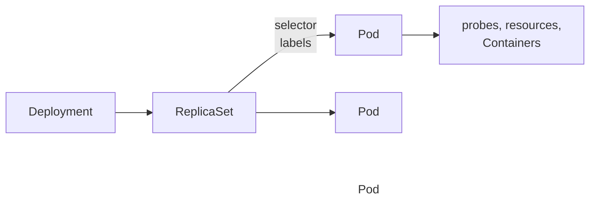

```mermaid
graph LR
    Deployment --> ReplicaSet
    ReplicaSet -->|selector<br/>labels| Pod1[Pod]
    ReplicaSet --> Pod2[Pod]
    Pod1 --> Containers["probes, resources,<br/>Containers"]

    style Pod3 fill:transparent,stroke:transparent
    ReplicaSet ~~~ Pod3[Pod]

```
