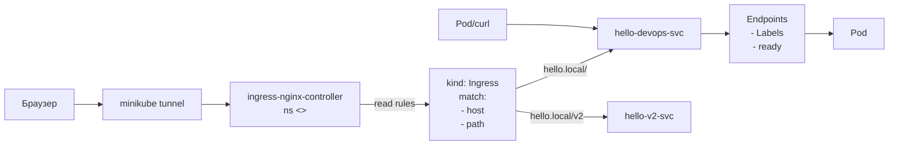

```mermaid
graph LR
    Browser[Браузер] --> Tunnel[minikube tunnel]
    Tunnel --> IngressCtrl["ingress-nginx-controller
    ns <<ingress-nginx>>"]
    IngressCtrl -->|read rules| IngressObj["kind: Ingress
    match:
    - host
    - path"]
    IngressObj -->|hello.local/| Svc1[hello-devops-svc]
    IngressObj -->|hello.local/v2| Svc2[hello-v2-svc]
    PodCurl[Pod/curl] --> Svc1
    Svc1 --> Endpoints["Endpoints
    - Labels
    - ready"]
    Endpoints --> Pod[Pod]

```
