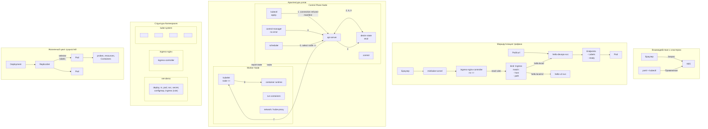

```mermaid
graph TD
%% 1. Общий поток пользователя и Kubernetes
subgraph ClientView [Взаимодействие с кластером]
Browser[Браузер] -->|Запрос| K8S[K8S]
YAML["yaml + kubectl"] -->|Применение| K8S
end

    %% 2. Компоненты Ingress-маршрутизации
    subgraph IngressFlow [Маршрутизация трафика]
        Browser2[Браузер] --> Tunnel[minikube tunnel]
        Tunnel --> IngressCtrl["ingress-nginx-controller
        ns <<ingress-nginx>>"]
        IngressCtrl -->|read rules| IngressObj["kind: Ingress
        match:
        - host
        - path"]
        IngressObj -->|hello.local/| Svc1[hello-devops-svc]
        IngressObj -->|hello.local/v2| Svc2[hello-v2-svc]
        PodCurl[Pod/curl] --> Svc1
        Svc1 --> Endpoints["Endpoints
        - Labels
        - ready"]
        Endpoints --> PodTarget[Pod]
    end

    %% 3. Архитектура кластера: Control Plane и Worker Nodes
    subgraph ClusterArchitecture [Архитектура узлов]
        subgraph CP [Control Plane Node]
            Kubectl["kubectl
            apply."] -->|1. connection refused
            manifest| APIServer[api-server]

            APIServer <-->|2, 6, 8| Etcd["desire state
            etcd"]

            ControlManager["control-manager
            no error"] -->|3| APIServer

            Scheduler["scheduler"] -->|5. select node <<X>>| APIServer
            APIServer -->|4| Etcd
            Control[control]
        end

        subgraph WN [Worker Node]
            APIServer -->|7| Kubelet["kubelet
            node <<X>>"]
            Kubelet -->|9| CR["container runtime"]
            Run[run containers]
            Net["network / kube-proxy"]
        end

        WN -->|report state| CP
        CP -->|tasks| WN
    end

    %% 4. Структура Namespaces
    subgraph ClusterNS [Структура Namespaces]
        subgraph NS1 ["net-demo"]
            Resources["deploy, rs, pod, svc, secret,
            configmap, ingress (rule)"]
        end
        subgraph NS2 ["ingress-nginx"]
            Controller["ingress-controller"]
        end
        subgraph NS3 ["kube-system"]
            Sys1[ ]
            Sys2[ ]
            Sys3[ ]
            Sys4[ ]
        end
    end

    %% 5. Иерархия объектов развертывания
    subgraph ObjectHierarchy [Жизненный цикл сущностей]
        Deployment --> ReplicaSet
        ReplicaSet -->|selector<br/>labels| Pod1[Pod]
        ReplicaSet --> Pod2[Pod]
        Pod1 --> Containers["probes, resources,
        Containers"]
    end
```
